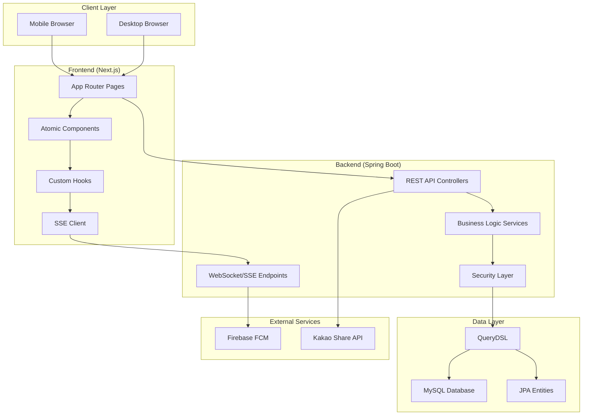

# 🌸 비밀로그 (BimilLog)

**익명으로 마음을 전하는 롤링페이퍼 플랫폼**

---

_따뜻한 마음을 익명으로 전달하는 디지털 롤링페이퍼 서비스_

## 📖 서비스 소개

**비밀로그(BimilLog)**는 누구나 쉽게 롤링페이퍼를 만들고 익명의 따뜻한 메시지를 주고받을 수 있는 플랫폼입니다.
모바일 최적화된 직관적인 UI와 실시간 알림 시스템을 통해 현대적이고 편리한 사용자 경험을 제공합니다.

### ✨ 핵심 가치

- 🤗 **따뜻함**: 진심 어린 메시지로 사람들의 마음을 따뜻하게
- 🔒 **익명성**: 부담 없이 솔직한 마음을 전달
- 📱 **접근성**: 언제 어디서나 쉽게 사용할 수 있는 모바일 최적화
- 🎨 **개성**: 다양한 테마와 디자인으로 나만의 롤링페이퍼 꾸미기

## 🎯 주요 기능

### 🌟 **롤링페이퍼 시스템**

- **페이지네이션 그리드**: PC(6x10), 모바일(4x10) 최적화된 레이아웃
- **다양한 디자인**: 시즌별, 테마별 롤링페이퍼 꾸미기
- **실시간 미리보기**: 작성 중인 메시지 즉시 확인
- **방문 기록**: 최근 방문한 롤링페이퍼 자동 저장 (최대 5개, 30일)

### 💬 **메시지 & 소통**

- **익명 메시지**: 로그인 없이도 메시지 작성 가능
- **댓글 시스템**: 게시글별 실시간 댓글 및 대댓글
- **추천 시스템**: 추천 기능으로 인기 콘텐츠 큐레이션
- **실시간 알림**: SSE + FCM 기반 즉시 알림

### 🔔 **스마트 알림 시스템**

- **실시간 연결**: Server-Sent Events로 즉시 알림 수신
- **모바일 푸시**: Firebase Cloud Messaging 연동
- **배치 처리**: 효율적인 알림 관리 (개별: 5분 배치, 전체: 즉시)
- **모바일 최적화**: 바텀시트 UI로 터치 친화적 인터페이스

### 📱 **게시판 & 커뮤니티**

- **공지사항**: 중요한 소식 전달
- **인기글**: 실시간/주간/레전드 게시글 큐레이션
- **검색 기능**: 제목, 내용, 작성자별 통합 검색
- **신고 시스템**: 건전한 커뮤니티 환경 조성

## 🛠️ 기술 스택

### **Frontend**

- **Framework**: Next.js 14 (App Router)
- **Language**: TypeScript
- **Styling**: Tailwind CSS + Design Token System
- **Architecture**: Atomic Design Pattern
- **State Management**: React Hooks + Custom Hooks
- **Real-time**: Server-Sent Events (SSE)
- **Mobile Push**: Firebase Cloud Messaging (FCM)

### **Backend**

- **Framework**: Spring Boot 3.x
- **Language**: Java 17
- **Database**: MySQL + QueryDSL
- **Security**: Spring Security + JWT
- **Real-time**: Server-Sent Events
- **Push Notification**: Firebase Admin SDK

### **Infrastructure & Tools**

- **Deployment**: Docker + Docker Compose
- **CI/CD**: GitHub Actions (예정)
- **Monitoring**: Application Health Check
- **Storage**: Local File System + Firebase Storage (예정)

## 🏗️ 아키텍처

## 📱 주요 페이지 미리보기

### 🏠 **메인 페이지**

- Pink-Purple-Indigo 그라디언트 테마
- 서비스 소개 및 주요 기능 안내
- 모바일 퍼스트 반응형 디자인

### 🎨 **롤링페이퍼**

- 페이지네이션된 그리드 시스템
- 실시간 메시지 추가/조회
- 다양한 데코레이션 옵션

### 💬 **게시판**

- 공지사항, 일반글, 인기글 분류
- 실시간 댓글 시스템
- 검색 및 필터링 기능

### 🔔 **알림 시스템**

- 데스크톱: 팝오버 형태
- 모바일: 바텀시트 형태
- 실시간 푸시 알림

## 🎨 Design System

### **아토믹 디자인 패턴**

- **Atoms**: Button, Input, Label 등 기본 UI 요소
- **Molecules**: Card, FormField, SearchBox 등 조합 컴포넌트
- **Organisms**: Header, PostList, NotificationBell 등 복잡한 섹션
- **Templates**: PageTemplate, AuthTemplate 등 레이아웃

### **모바일 최적화**

- **터치 타겟**: 최소 44px, 권장 48px
- **Safe Area**: iOS 노치/홈바 대응
- **Performance**: 60fps 애니메이션, 즉시 피드백
- **Accessibility**: 터치 친화적 UI/UX

### **디자인 토큰**

- **Colors**: Pink-Purple-Indigo 그라디언트 팔레트
- **Typography**: 모바일 기준 16px 최소 크기
- **Spacing**: 4px 기준 배수 체계
- **Shadows**: 모바일 특화 그림자 시스템

## 📅 개발 일정

| 단계          | 기간                      | 상태    | 설명             |
| ------------- |-------------------------|-------| ---------------- |
| **개발**      | 2025-03-23 ~ 2025-05-10 | 완료    | 핵심 기능 개발   |
| **테스트**    | 2025-05-11 ~ 2025-05-18 | 완료  | 테스트 서버 운영 |
| **리팩토링**  | 2025-05-19 ~ 2025-06-30 | 완료  | 코드 최적화      |
| **정식 런칭** | 2025-07-01              |  | 서비스 정식 오픈 |

### **개발 가이드라인**

- **코드 스타일**: ESLint + Prettier (Frontend), CheckStyle (Backend)
- **커밋 컨벤션**: Conventional Commits
- **브랜치 전략**: Git Flow
- **테스트**: Jest (Frontend), JUnit (Backend)

## 📞 연락처 & 지원

- **🌐 웹사이트**: [grow-farm.com](https://grow-farm.com)
- **📧 이메일**: support@grow-farm.com
- **💬 문의**: GitHub Issues

## 📄 라이선스

이 프로젝트는 [MIT License](LICENSE)를 따릅니다.

---

**🌸 비밀로그와 함께 따뜻한 마음을 나눠보세요! 🌸**

Made with ❤️ by BimilLog Team

